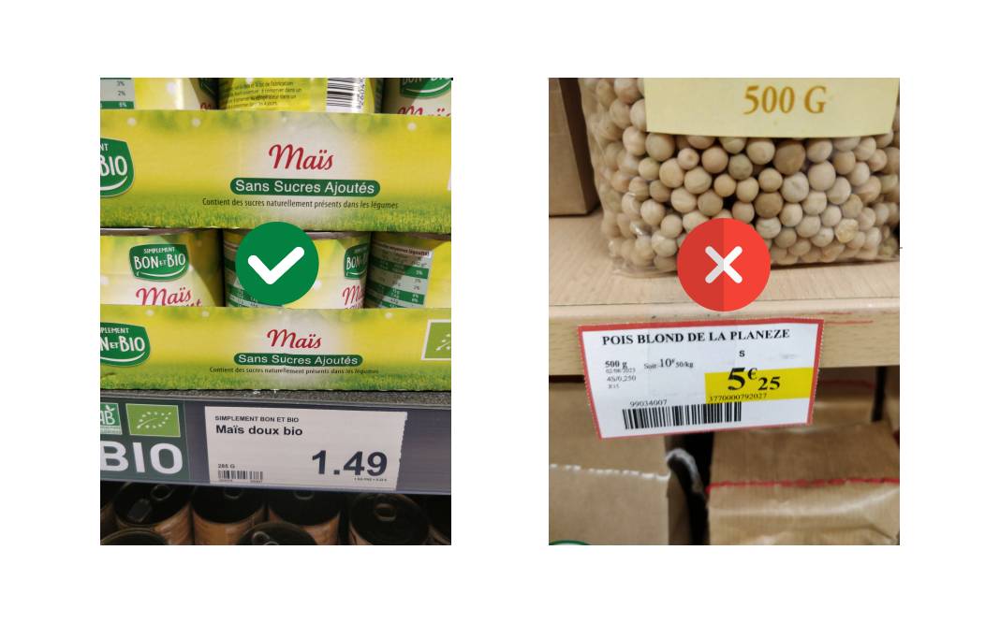

# Contribute by adding a price

This tutorial is a step-by-step guide to add a price using [the web interface](https://prices.openfoodfacts.org/app/). If you have any questions, please ask us on [Slack](https://openfoodfacts.slack.com), on the #prices channel!

To add a price, we need some information, such as the product price, the location (=store), a proof photo, etc.

Only the prices of food products are currently accepted.

## Step 1: Take a picture of the price tag + product

We need a picture of the price tag that acts as a proof so that the data can be verified independently. Ideally, the image should contain both the price tag and the product. The product should be clearly visible, and the price tag should be readable.

On the first picture, the price tag and the product are visible. However, on the second picture, it's difficult to recognize the product using the photo alone.

## Step 2: Add the price

The steps to add a price differ depending on whether the product is raw (fruits, vegetables) or with a barcode.

If it has a barcode, you need to scan it, so that we can identify the product. You should then add the price for a single product (1 unit).

If it doesn't have a barcode (raw products), you should first select the category among the dropdown list, then add the price for 1 kg of product. Not all categories are available yet, so if you can't find the right one, please let us know. Support for other units (e.g. 1 apple) is not yet available, but will be added soon.

## Step 3: Add the location

The location is the store where the product was found. This can be a supermarket, a local store, a farmer's market, etc. The only requirement is that it is a physical location where you can buy food. The location needs to be registered in Open Street Map, otherwise you won't be able to select it. If your store is not in Open Street Map, you can add it there first (ask for help if you're not familiar with Open Street Map!).

## Step 4: Add the date

This is when you found the price. This is important because prices change over time, and we want to be able to track these changes.