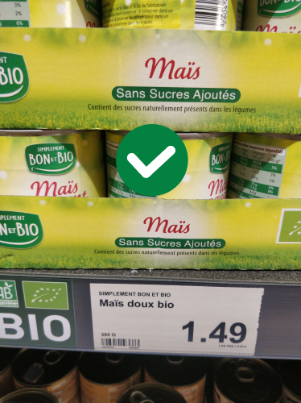
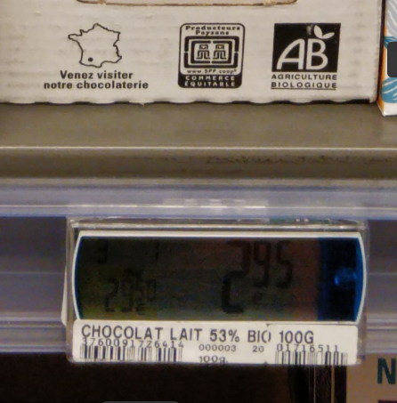

# Contribute by adding prices

## Single price mode

This tutorial is a step-by-step guide to add a price using [the web interface](https://prices.openfoodfacts.org). If you have any questions, please ask us on [Slack](https://openfoodfacts.slack.com), on the #prices channel!

To add a price, we need some information, such as the product price, the location (=store), a proof photo, etc.

Only the prices of food products are currently accepted.

### Step 1: Identify the product

Identifing the product helps users know if they have scanned the right product to start with. We'll display info from Open Food Facts database, as well as the number of prices already available in the Open Prices database.

The steps to add a product differ depending on whether the product is:
- with a barcode
- or raw (fruits, vegetables)

If it doesn't have a barcode (raw products), you should select the category among the dropdown list. Not all categories are available yet, so if you can't find the right one, please let us know. Support for other units (e.g. 1 apple) is not yet available, but will be added soon.

### Step 2: Add the price (with a proof)

For raw products, the price for 1 kg is expected.

If the price is discounted, we currently expect the full price to be provided (improvements coming soon).

We need a picture of the price tag that acts as a proof so that the data can be verified independently. Ideally, the image should contain both the price tag and the product. The product should be clearly visible, and the price tag should be readable.

#### Proof examples

|Good|Bad|
|---|---|
|||
|Both the price tag and the product are visible|Here it's difficult to recognize the product using the photo alone|

### Step 3: Add the location & date

The location is the store where the product was found. This can be a supermarket, a local store, a farmer's market, etc. The only requirement is that it is a physical location where you can buy food. The location needs to be registered in OpenStreetMap, otherwise you won't be able to select it. If your store is not in OpenStreetMap, you can add it there first (ask for help if you're not familiar with OpenStreetMap!).

The date is when you found the price. It can be different from the date you actually add the price. This is important because prices change over time, and we want to be able to track these changes.
