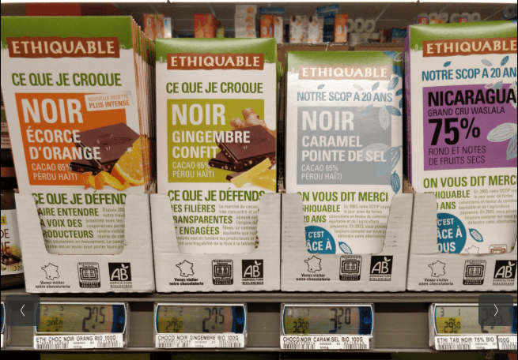
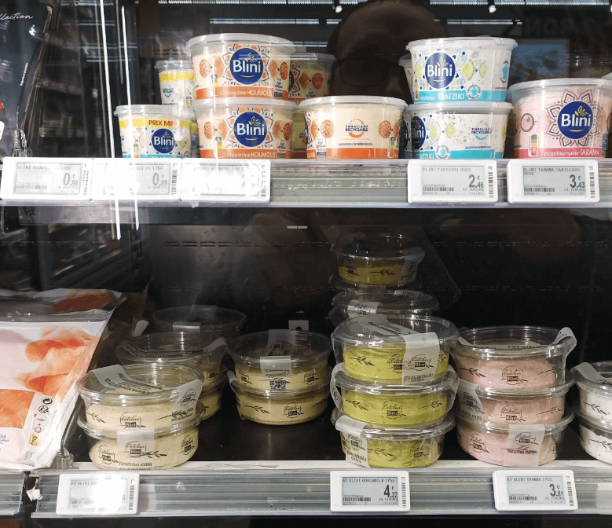

# Contribute by adding prices

## Multiple price mode (shop shelf)

This tutorial is a step-by-step guide to add multiple prices using [the web interface](https://prices.openfoodfacts.org). If you have any questions, please ask us on [Slack](https://openfoodfacts.slack.com), on the #prices channel!

To add the prices, we need some information, such as a proof photo of the shelf containing the products and their corresponding prices, as well as a location (=store), etc.

Only the prices of food products are currently accepted.

### Step 1: take a photo (proof)

We need a picture of the shelf, showing the products with their price tags. This picture will be used as a proof so that the data can be verified independently. The products should be clearly visible, and the price tags should be readable.

#### Proof examples

|Good|Bad|
|---|---|
|||
|||

### Step 2: Add the location & date

The location is the store where the products are found. This can be a supermarket, a local store, a farmer's market, etc. The only requirement is that it is a physical location where you can buy food. The location needs to be registered in OpenStreetMap, otherwise you won't be able to select it. If your store is not in OpenStreetMap, you can add it there first (ask for help if you're not familiar with OpenStreetMap!).

The date is when you found the prices. It can be different from the date you actually add the prices. This is important because prices change over time, and we want to be able to track these changes.

### Step 3: Add the product prices one by one

If the products contain barcodes, you can now click on "Add a price", and start adding the product prices one by one. It's fast, as we need only 2 information per product: it's barcode, and it's price.

If it doesn't have a barcode (raw products), you should select the category among the dropdown list. Not all categories are available yet, so if you can't find the right one, please let us know. Support for other units (e.g. 1 apple) is not yet available, but will be added soon.
