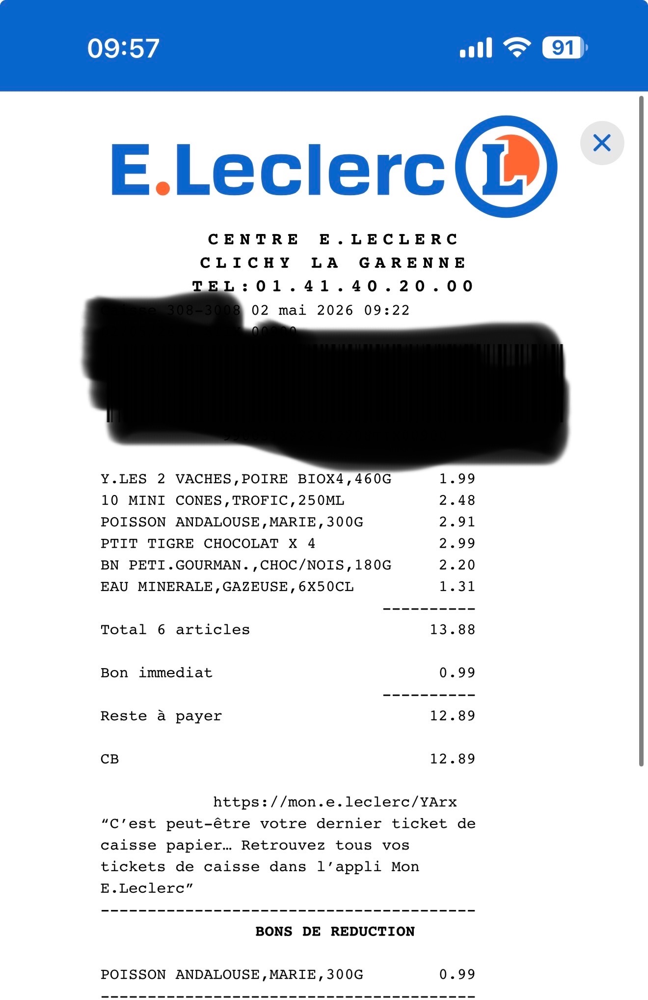
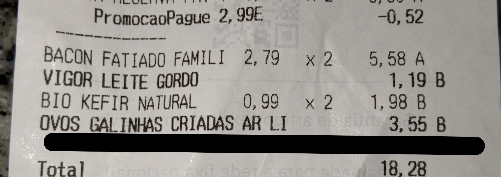

# Add multiple prices (from a receipt)

This tutorial is a step-by-step guide to add multiple prices, using receipts, via the [web interface](https://prices.openfoodfacts.org).

> ℹ️ If you have any questions, please ask us on [Slack](https://openfoodfacts.slack.com), on the #prices channel!

## Prerequisites

To add prices using receipts, you need:

- A clear photo of the receipt as proof
- The store location
- The purchase date

## Step 1: Take a photo of the receipt (proof)

We need a picture of your shopping receipt showing the list of purchased items and their prices. This picture will be used as proof so that the data can be verified independently.

Make sure:

- The receipt is fully visible (no cropped edges)
- Product names and prices are readable
- The store name and date are visible

> ⚠️ Receipts may contain personal information, we recommend to hide them (redact, fold...) before taking the picture.

### Proof examples

| Good | Bad |
| ---- | --- |
|  |   incomplete |

## Step 2: Add the location & date

The location is the store where you purchased the products. This must be a physical store such as a supermarket, grocery shop...

The location needs to be registered in OpenStreetMap, otherwise you won’t be able to select it. If your store is not listed, you can add it there first (ask for help if needed).

The date is when the purchase was made (same as the one printed on the receipt). This is important because prices change over time, and we want to track those changes accurately.

## Step 3: Upload the receipt

Upload the receipt image to the platform. The system will use it to extract product information and prices.

Make sure the uploaded image:

- Matches the store and date you selected
- Is clear enough to read all items

> ✨ AI will run on these images to extract each product & price.

## Step 4: Add or verify product prices

After uploading the receipt, you can:

- Add products manually by entering their barcode and price, or
- Verify and correct automatically extracted items (if available)

For each product, we typically need:

- Barcode (if available)
- Price

If a product does not have a barcode (e.g. fresh produce), select the closest matching category from the dropdown list.
