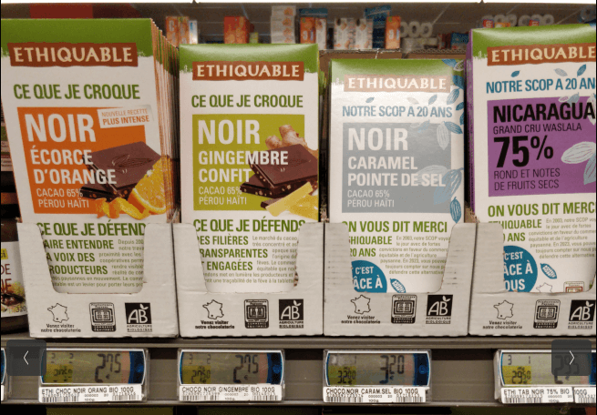
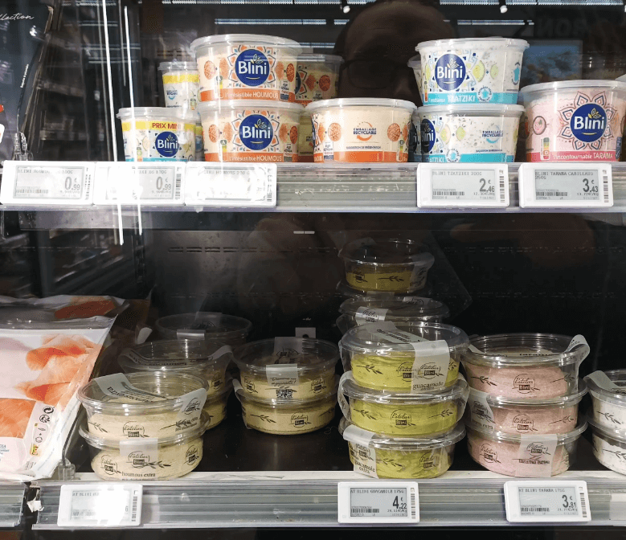

# Add multiple prices (from shelf images)

This tutorial is a step-by-step guide to add multiple prices, using shelf images, via the [web interface](https://prices.openfoodfacts.org).

> ℹ️ If you have any questions, please ask us on [Slack](https://openfoodfacts.slack.com), in the #prices channel.

## Prerequisites

To add shelf prices, you need:

- A proof photo of the shelf showing products and prices
- The store location
- The date when the prices were observed

## Step 1: Take a photo of the shelf (proof)

Take a clear picture of the shelf showing products along with their price tags. This serves as proof so the data can be verified.

Make sure:

- Products are clearly visible
- Price tags are readable
- The image is well-lit and not blurry
- The photo captures enough context (not overly zoomed in)

### Proof examples

| Good | Bad |
| ---- | --- |
|  |   blurry |

## Step 2: Add the location & date

The location is the store where you observed the prices. This must be a physical store such as a supermarket, grocery shop...

The location needs to be registered in OpenStreetMap, otherwise you won’t be able to select it. If your store is not listed, you can add it there first (ask for help if needed).

The date is when the prices were observed. This is important because prices change over time, and we want to track those changes accurately.

## Step 3: Upload the shelf image(s)

Upload the shelf image(s) to the platform. You can select multiple images if they share the same metadata (date & location).

> ✨ AI will run on these images to detect each price tag, and extract the product & price for each of them.

## Step 4: Verify product prices

Go to the "Validation assistant" page to review and validate the extracted prices.
