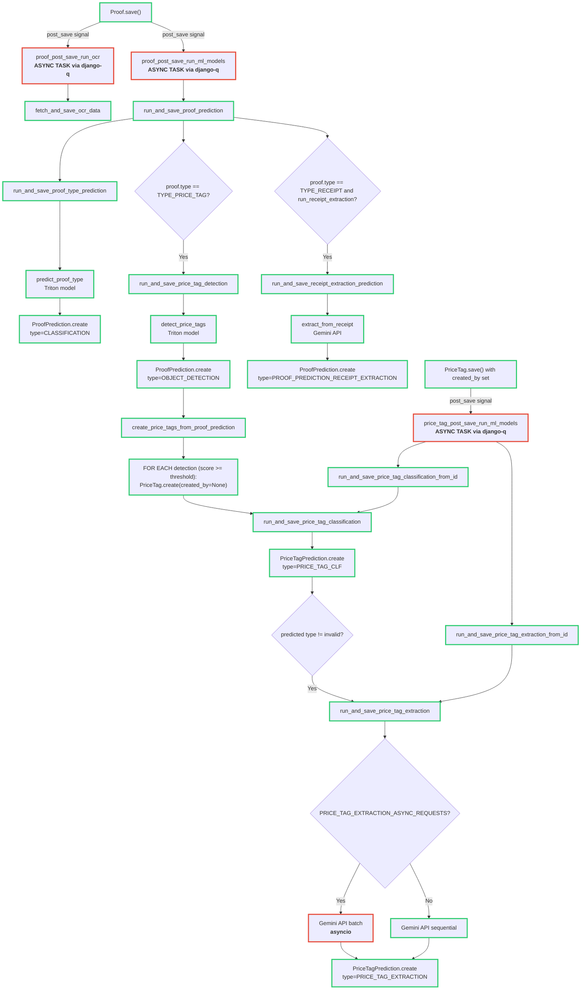

# Proof & Price Tag Prediction Flow

This document maps prediction-related operations for both proof and price tag creation.

## Flow Diagram

## Notes

- Green border: synchronous execution.
- Red border: asynchronous execution (django-q task or asyncio batch).
- The proof-created flow and manual price-tag-created flow share the same price tag classification and extraction functions.

## Configuration

- `ENABLE_ML_PREDICTIONS`
- `ENABLE_OCR`
- `PRICE_TAG_EXTRACTION_ASYNC_REQUESTS`
