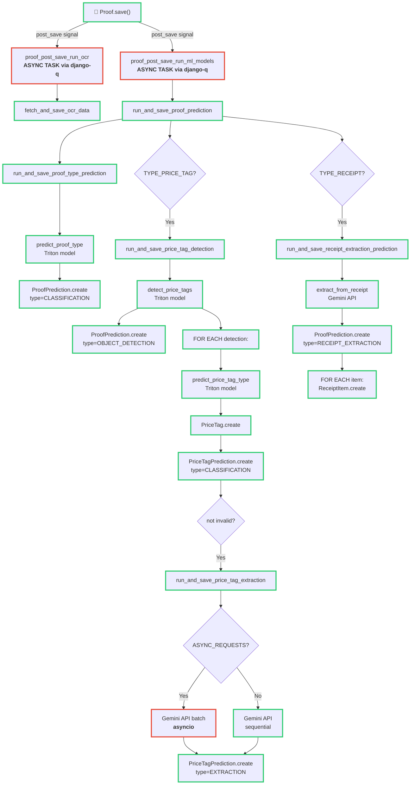

# Proof Prediction Flow

This document maps out the synchronous and asynchronous operations that occur when a proof is created, with a focus on the machine learning prediction pipeline.

## Overview

When a proof is saved, several prediction models are triggered:

- **Proof Type Classification** - Classifies the proof type (receipt, price tag, etc.)
- **Price Tag Detection** - Detects price tags in the image (for price tag proofs)
- **Price Tag Extraction** - Extracts barcode, price, and other data from each price tag (for price tag proofs)
- **Receipt Extraction** - Extracts items and prices from receipt images (for receipt proofs)

## Flow Diagram

## Execution Model

### Synchronous (Green 🟢)
- User API call returns immediately after `Proof.save()` completes
- Database counts are updated synchronously
- Post-save signals execute in the same process

### Asynchronous (Pink 🔴)
- ML prediction pipeline runs in a **django-q worker process**
- OCR tasks run separately (if enabled)
- Nested asyncio for Gemini API batch requests (if `PRICE_TAG_EXTRACTION_ASYNC_REQUESTS=True`)

### Conditional (Yellow 🟡)
- Predictions vary based on `proof.type`
- Price tag extraction only runs on quality predictions (not "invalid")

## Key Implementation Details

### Proof Type Classification
- **Source**: `open_prices.proofs.ml.classification.run_and_save_proof_type_prediction()`
- **Model**: Triton (proof classification)
- **Stored as**: `ProofPrediction` with `type=CLASSIFICATION`

### Price Tag Detection (TYPE_PRICE_TAG only)
- **Source**: `open_prices.proofs.ml.price_tags.run_and_save_price_tag_detection()`
- **Model**: Triton (object detection)
- **Creates**: `ProofPrediction` + multiple `PriceTag` objects
- **Signal cascade**: Each `PriceTag.create` triggers image generation

### Price Tag Extraction (TYPE_PRICE_TAG only)
- **Source**: `open_prices.proofs.ml.price_tags.run_and_save_price_tag_extraction()`
- **Model**: Gemini (structured data extraction)
- **Creates**: `PriceTagPrediction` with barcode, price, and product info
- **Optimization**: Can batch Gemini requests with asyncio (controlled by `PRICE_TAG_EXTRACTION_ASYNC_REQUESTS`)

### Receipt Extraction (TYPE_RECEIPT only)
- **Source**: `open_prices.proofs.ml.receipts.run_and_save_receipt_extraction_prediction()`
- **Model**: Gemini (structured data extraction)
- **Creates**: `ProofPrediction` + multiple `ReceiptItem` objects
- **Lookup**: Matches extracted product names against existing prices for product codes

## Signal-Driven Count Updates

The following counts are updated via post-save signals:

| Model | Signal | Field Updated |
|-------|--------|---|
| `ProofPrediction` | `post_save` on create | `Proof.prediction_count += 1` |
| `PriceTagPrediction` | `post_save` on create | `PriceTag.prediction_count += 1` |
| `PriceTag` | `post_save` on create | triggers tag update and image generation |

## Configuration

Key settings that control this flow:

- `ENABLE_ML_PREDICTIONS` - Toggle entire ML pipeline
- `ENABLE_OCR` - Toggle OCR task
- `PRICE_TAG_EXTRACTION_ASYNC_REQUESTS` - Use asyncio batch for Gemini requests

## Files

- **Models**: `open_prices/proofs/models.py`
- **ML Pipeline**: `open_prices/proofs/ml/__init__.py`
- **Classification**: `open_prices/proofs/ml/classification.py`
- **Price Tags**: `open_prices/proofs/ml/price_tags.py`
- **Receipts**: `open_prices/proofs/ml/receipts.py`
- **OCR**: `open_prices/proofs/ml/ocr.py`
